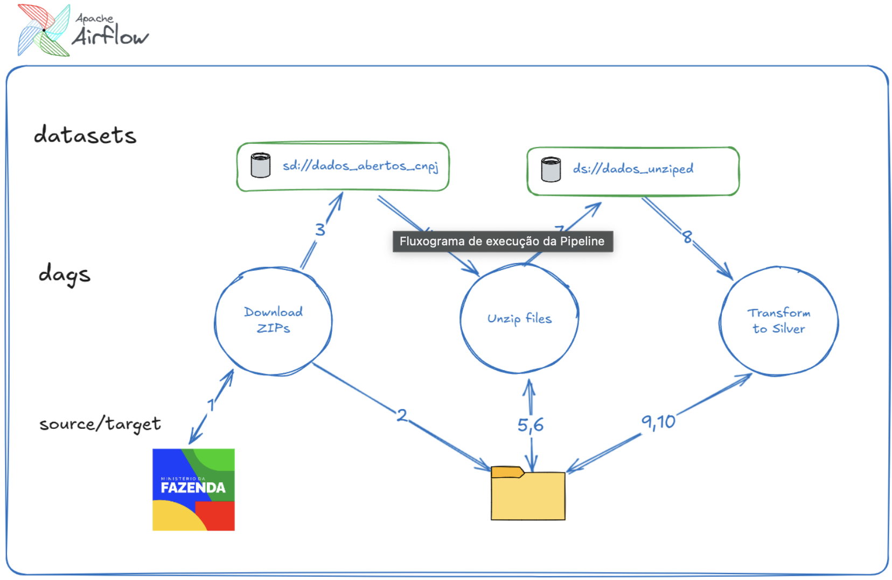

# CNPJs Brasil
Este projeto implementa uma pipeline de ETL em Airflow que realiza as seguintes operações:

Extrai os dados públicos de CNPJs disponibilizados no portal do Ministério da Fazenda (https://arquivos.receitafederal.gov.br/dados/cnpj/dados_abertos_cnpj/);

Trata os dados construindo um dataframe sintetizado das informações;

Remove registros que não são de clínicas odontológicas;
Salva os dados tratados e limpos em parquet.
A figura abaixo ilustra o processo de execução no Airflow:



## Dags
| DAG     |	Trigger   |	Descrição | 
| ------- | ----- |	--------  | 
| Download Zips | Manual/Agendado |	Realiza o download dos arquivos do site do Ministério da Fazenda. Devido ao tamanho dos arquivos e a baixa velocidade do link do MF esse processo pode demorar algumas horas. | 
| Unzip files | dataset data_abertos_cnpj | Descompacta os arquivos zip. |
| Transform to Silver | dataset dados_unzip	| Carrega os arquivos descompactados, executa os tratamentos dos dados e armazena o resultado final em .parquet.

## Estrutura final dos dados
A tabela abaixo apresenta a lista de campos que ficam disponibilizadas no arquivo final (.parquet):

| Campo | 	Exemplo | 
| ----- | --------- |
|cnpj_basico |32998915
| cnpj_ordem |	0001 |
| cnpj_dv |	80 |
| cnpj |	32998915000180 |
| cd_matriz_filial |	1 |
| matriz_filial |	Matriz |
| nome_fantasia |	CLINICA SORRISO |
| cd_situacao_cadastral |	02 |
| situacao_cadastral |	Ativa |
| data_situacao_cadastral |	2019-02-18 |
| cd_motivo_situacao_cadastral |	00 |
| motivo_situacao_cadastral |	SEM MOTIVO |
| nome_cidade_exterior |	LISBOA |
| cd_pais |	105 |
| pais |	BRASIL |
| data_inicio_atividades |	2019-02-18 |
| cd_cnae_fiscal |	8630504 |
| cnae_fiscal |	Atividade odontológica |
| cd_cnae_fiscal_secundario |	0151202 |
| tipo_logradouro |	RUA |
| logradouro |	RUFFO GALVAO |
| numero |	55 |
| complemento |	EDIF DILSON CORDIER ANDAR 4 ANDAR SALA 40 |
| bairro |	CENTRO |
| cep |	45600195 |
| uf |	BA |
| cd_municipio |	3597 |
| municipio |	ITABUNA |
| ddd1 |	73 |
| telefone1 |	36130123 |
| ddd2 |	24 |
| telefone2 |	36130123 |
| ddd_fax |	24 |
| fax |	2975288 |
| correio_eletronico |	RECONTECONTABILIDADE@MAIL.COM |
| cd_situacao_especial |	FALIDO |
| data_situacao_especial |	2019-02-18 |
| Ambiente | de desenvolvimento |

## Criação do env conda

```bash
conda create --prefix ./condaenv python=3.12 pip
conda activate ./condaenv
```

**Obs.: É possível utilizar também Python com venv.** 

## Instalando as dependências do projeto

Para executar os Notebook do projeto é necessário também instalar o Jupyter no novo env criado:

```bash
conda install jupyter
```

As libs abaixo são necessárias para execução do scripts

```bash
pip install -r requirements.txt
```

## Instalando Airflow (docker-compose)

Como a DAG executa operações Spark direto nas tasks do Airflow, criamos uma imagem customizada que instala todas as dependências necessárias.

Os comandos abaixo compilam a imagem e sobem o serviço do Airflow utilizando a imagem customizada:

```bash
docker-compose build
docker-compose up airflow-init
```

Se o Airflow já tiver sido instalado basta executar com o comando abaixo:

```bash
docker-compose up
```
## Ambiente de produção
Para executar em ambiente de produção os seguintes requisitos devem ser observados:

- Garantir que o Airflow possui as dependências necessárias 2. É possível utilizar o Dockerfile para construir uma imagem customizada com as dependências já incluídas
- Garantir que os recursos disponíveis para o Airflow são o suficiente para o processamento 3. Mínimo 8GB Ram

## Ajustes recomendados:

- Definir os paths dos arquivos via variáveis do Airflow
- Armazenar os dados finais em sistema de Data Warehousing (ex.: Databricks, Snowflake, Redshift...)